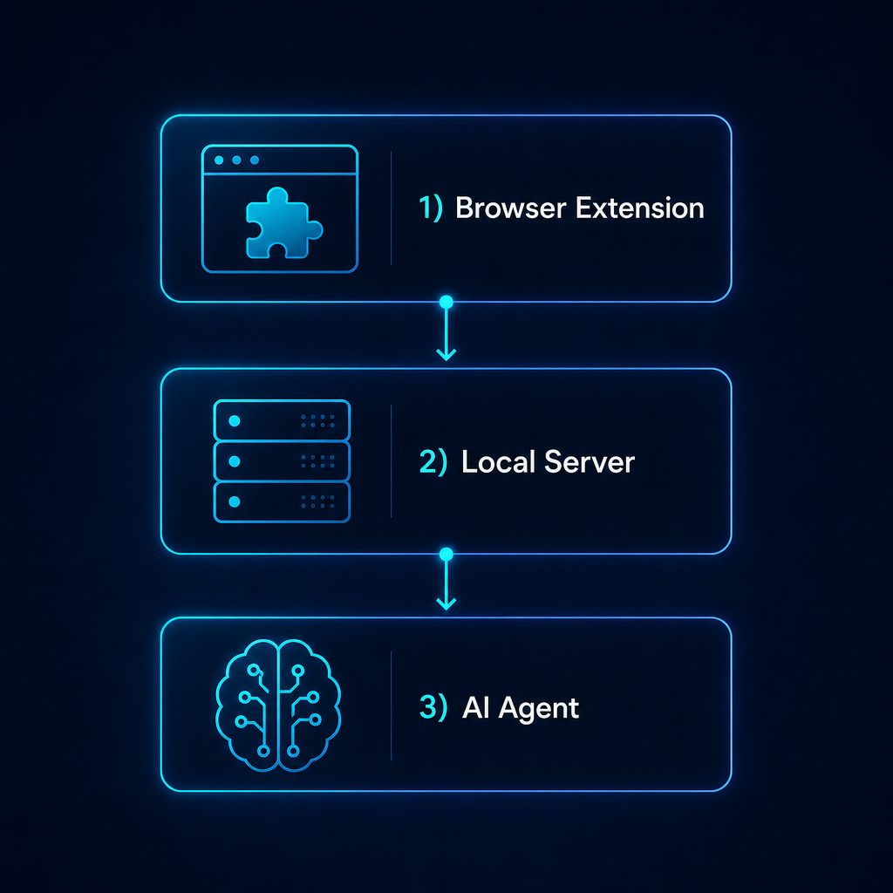

# tmwd-cdp-bridge

Standalone local bridge for the existing TMWD CDP Bridge Chrome/Edge extension.

[中文介绍](README.zh-CN.md) | [Visual intro](docs/visual-intro.md) |
[Releases](https://github.com/koda-claw/tmwd-cdp-bridge/releases)


It exposes:

- WebSocket extension channel on `127.0.0.1:18765`
- HTTP RPC API on `127.0.0.1:18766`
- Fixed extension ID `eghifjkffmcmffejmaaeicejpfopplem`

## Visual Overview



`tmwd-cdp-bridge` connects three pieces:

1. A Chrome/Edge MV3 extension running inside the user's browser.
2. A localhost-only Rust bridge exposing WebSocket and HTTP RPC endpoints.
3. Any agent that can run shell commands, read local files, and call local HTTP.

More diagrams are available in [docs/visual-intro.md](docs/visual-intro.md).

## Quick Start

If another agent only has this repository URL, have it follow this order:

1. Install the `tmwd-cdp-bridge` binary.
2. Install the `skills/tmwd-cdp-bridge` skill folder into its local skills directory.
3. Run `tmwd-cdp-bridge install edge` or `install chrome`.
4. Load the printed unpacked extension directory in the browser extensions page.
5. Start or reuse the bridge and use `/health` plus authenticated `/v1/rpc`.

## Install Binary

Preferred: use the platform-detecting installer from a source checkout:

```sh
git clone https://github.com/koda-claw/tmwd-cdp-bridge.git
cd tmwd-cdp-bridge

# macOS/Linux: auto-detects OS and CPU architecture.
SKILL_DIR="$HOME/.codex/skills" sh scripts/install.sh
```

On Windows PowerShell:

```powershell
git clone https://github.com/koda-claw/tmwd-cdp-bridge.git
cd tmwd-cdp-bridge
$env:SKILL_DIR="$HOME\.codex\skills"
powershell -ExecutionPolicy Bypass -File scripts\install.ps1
```

The installers download the matching
[GitHub Release](https://github.com/koda-claw/tmwd-cdp-bridge/releases), install
the binary, and copy `skills/tmwd-cdp-bridge` when `SKILL_DIR` is set.

Manual download is also supported. Choose the archive for the local OS, extract
it, and put the binary on `PATH`.

Examples:

```sh
# macOS arm64
curl -L -o tmwd-cdp-bridge.tar.gz \
  https://github.com/koda-claw/tmwd-cdp-bridge/releases/download/v0.1.1/tmwd-cdp-bridge-macos-arm64.tar.gz
tar -xzf tmwd-cdp-bridge.tar.gz
chmod +x tmwd-cdp-bridge
mkdir -p "$HOME/.local/bin"
mv tmwd-cdp-bridge "$HOME/.local/bin/"

# Linux x64
curl -L -o tmwd-cdp-bridge.tar.gz \
  https://github.com/koda-claw/tmwd-cdp-bridge/releases/download/v0.1.1/tmwd-cdp-bridge-linux-x64.tar.gz
tar -xzf tmwd-cdp-bridge.tar.gz
chmod +x tmwd-cdp-bridge
mkdir -p "$HOME/.local/bin"
mv tmwd-cdp-bridge "$HOME/.local/bin/"
```

Windows users can download `tmwd-cdp-bridge-windows-x64.zip`, extract
`tmwd-cdp-bridge.exe`, and add its directory to `PATH`.

Source fallback:

```sh
git clone https://github.com/koda-claw/tmwd-cdp-bridge.git
cd tmwd-cdp-bridge
cargo build --release
```

Use `target/release/tmwd-cdp-bridge` directly or copy it to a directory on
`PATH`.

## Install Skill

If you did not set `SKILL_DIR` while running the installer, copy the repository
skill folder into the agent's local skills directory. The folder to copy is:

```text
skills/tmwd-cdp-bridge
```

Common examples:

```sh
# Codex-style local skill directory
mkdir -p "$HOME/.codex/skills"
cp -R skills/tmwd-cdp-bridge "$HOME/.codex/skills/"

# Generic agent skill directory
mkdir -p "$HOME/.agents/skills"
cp -R skills/tmwd-cdp-bridge "$HOME/.agents/skills/"
```

After installing the skill, ask the agent to use `tmwd-cdp-bridge` for browser
inspection or page automation. The skill itself explains the runtime flow and
RPC contract.

## Browser Setup

```sh
cargo run -- install edge
cargo run -- start
```

Load the copied extension directory in `edge://extensions` or `chrome://extensions`
with Developer mode enabled.

Then call:

```sh
APP_DIR="${CDP_BRIDGE_APP_DIR:-${XDG_DATA_HOME:-$HOME/.local/share}/tmwd-cdp-bridge}"
case "$(uname -s)" in
  Darwin) APP_DIR="${CDP_BRIDGE_APP_DIR:-$HOME/Library/Application Support/tmwd-cdp-bridge}" ;;
esac
TOKEN="$(cat "$APP_DIR/token")"
curl -s http://127.0.0.1:18766/v1/rpc \
  -H "Authorization: Bearer $TOKEN" \
  -H "Content-Type: application/json" \
  -d '{"cmd":"get_all_sessions"}'
```

On Windows, the default token path is
`%LOCALAPPDATA%\tmwd-cdp-bridge\token`.

## Real Usage

Real browser work should use the installed CLI server, the loaded unpacked
extension, `/health`, and authenticated `POST /v1/rpc` calls. Do not use the
repository E2E scripts to inspect user sites or logged-in pages.

```sh
cargo run -- start
curl -s http://127.0.0.1:18766/health
```

`/health` should report:

```json
{
  "server": "tmwd-cdp-bridge",
  "extension_connected": true,
  "extension_id": "eghifjkffmcmffejmaaeicejpfopplem"
}
```

A legacy extension ID `aikfggdiblmijobpgdapacebmcjknbof` uses an older protocol
and is intentionally unsupported. Keep that extension disabled when validating
this project.

Only `/v1/rpc` is supported for RPC. The old `/link` endpoint is intentionally
absent and should return `404`.

See [docs/api.md](docs/api.md) for the stable RPC contract.
See [docs/development.md](docs/development.md) for CI, release gates, regression
checks, and known limits. See [docs/troubleshooting.md](docs/troubleshooting.md)
for recovery steps.

For pages with strict CSP or isolated-world behavior, such as X.com, retry
`execute_js` with `"fallback":"cdp"` or use `"mode":"cdp"` with a Chrome
DevTools Protocol command object.

## Commands

```sh
tmwd-cdp-bridge start
tmwd-cdp-bridge stop
tmwd-cdp-bridge install edge
tmwd-cdp-bridge install chrome
tmwd-cdp-bridge repair edge
tmwd-cdp-bridge status
tmwd-cdp-bridge status --json
tmwd-cdp-bridge version
tmwd-cdp-bridge version --json
tmwd-cdp-bridge upgrade
```

`status` prints a human-readable summary. Use `status --json` for agents,
scripts, and CI checks.

## Install, Upgrade, Uninstall

Install or refresh the unpacked extension:

```sh
tmwd-cdp-bridge install edge
tmwd-cdp-bridge install chrome
```

Upgrade the installed CLI binary from GitHub Releases:

```sh
tmwd-cdp-bridge upgrade
tmwd-cdp-bridge upgrade --json
```

On Windows, the running `.exe` may be replaced just after the `upgrade` process
exits. Re-run `tmwd-cdp-bridge version` to confirm the active binary.

Uninstall by stopping the bridge, removing the unpacked extension from
`edge://extensions` or `chrome://extensions`, and deleting the runtime directory
listed below if you no longer need the token or copied extension files.

## Validation

```sh
cargo fmt --all --check
cargo clippy --all-targets -- -D warnings
cargo test
node --check extension/background.js
node --check scripts/e2e_chrome_smoke.mjs
node --check scripts/e2e_browser_inspect_url.mjs
node --check scripts/smoke_no_extension.mjs
node --check scripts/skill_minimal_flow.mjs
node --check scripts/soak_bridge.mjs
node --check scripts/smoke_real_browser.mjs
python3 scripts/validate_skill.py skills/tmwd-cdp-bridge
```

The E2E scripts are development and regression harnesses. They start temporary
browser profiles, load the unpacked extension, start temporary bridge servers on
random ports, open local test pages or requested URLs, and verify protocol
behavior. They are not the workflow for real user tasks.

By default the script uses Microsoft Edge on macOS because it reliably honors
`--load-extension` in this environment. Override with `BROWSER_BIN` or
`CHROME_BIN` to test a specific Chromium-family browser.

For release gates and CI details, see [docs/development.md](docs/development.md).

## Runtime Directory

The app uses platform data directories:

- macOS: `~/Library/Application Support/tmwd-cdp-bridge`
- Linux: `$XDG_DATA_HOME/tmwd-cdp-bridge` or `~/.local/share/tmwd-cdp-bridge`
- Windows: `%LOCALAPPDATA%\tmwd-cdp-bridge`

Set `CDP_BRIDGE_APP_DIR` to override this for tests or local development.
