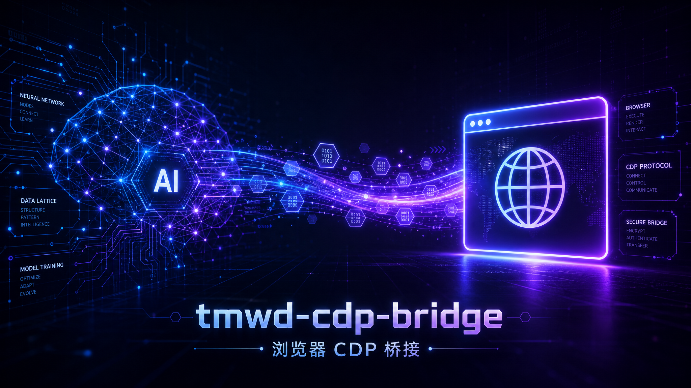
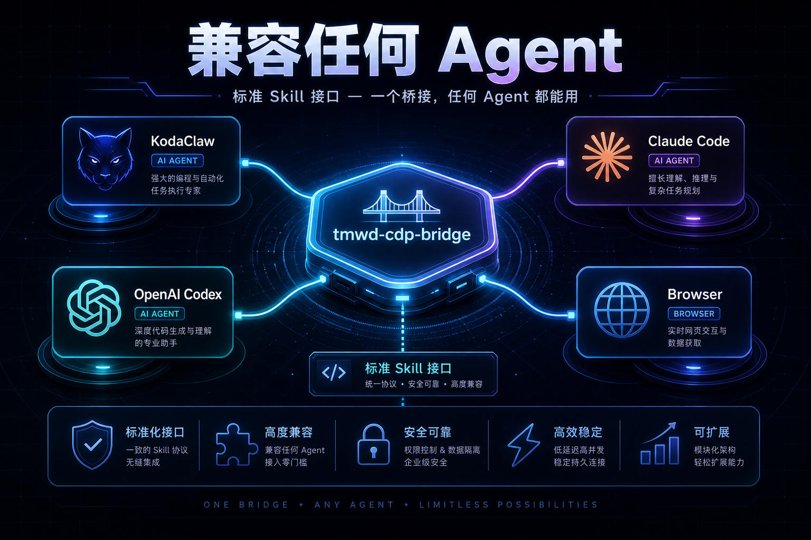

# tmwd-cdp-bridge 中文介绍

[English README](README.md) | [图文介绍](docs/visual-intro.md) |
[Releases](https://github.com/koda-claw/tmwd-cdp-bridge/releases)



`tmwd-cdp-bridge` 是一个面向通用 Agent 的本地浏览器桥接工具。它通过
Chrome/Edge 扩展连接真实浏览器，再由本地 Rust 服务提供 HTTP RPC 接口，让
Agent 可以在用户本机浏览器里读取页面、执行 JavaScript、使用 CDP fallback，
并复用已经登录的浏览器会话。

它不是某个特定 Agent 的私有能力。任何能安装 skill、运行命令、读取本地文件、
调用 `127.0.0.1` HTTP 接口的 Agent，都可以按同一套流程使用。

## 它解决什么问题


很多网页任务需要真实浏览器环境：登录态、复杂前端渲染、CSP、动态 DOM、弹窗、
跳转、新标签页、以及少量需要 Chrome DevTools Protocol 的场景。
`tmwd-cdp-bridge` 把这些能力收敛成一个本地、可验证、可脚本化的桥接层：

- 只监听 `127.0.0.1`，不对外暴露端口。
- 使用固定扩展 ID：`eghifjkffmcmffejmaaeicejpfopplem`。
- 只支持 `POST /v1/rpc`，旧 `/link` 不再兼容。
- token 存在本机平台数据目录，Agent 使用时读取 token，但不要打印完整 token。
- 支持普通页面 JS 执行，也支持 `fallback:"cdp"` 和直接 CDP 命令。

## 工作方式



基本链路是：

1. 安装 `tmwd-cdp-bridge` 二进制。
2. 把 `skills/tmwd-cdp-bridge` 安装到 Agent 的本地 skills 目录。
3. 运行 `tmwd-cdp-bridge install edge` 或 `install chrome`。
4. 在浏览器扩展页加载打印出来的 unpacked extension 目录。
5. 启动 bridge，用 `/health` 和带 token 的 `/v1/rpc` 做真实浏览器操作。

## 快速安装

macOS/Linux：

```sh
git clone https://github.com/koda-claw/tmwd-cdp-bridge.git
cd tmwd-cdp-bridge
SKILL_DIR="$HOME/.codex/skills" sh scripts/install.sh
```

Windows PowerShell：

```powershell
git clone https://github.com/koda-claw/tmwd-cdp-bridge.git
cd tmwd-cdp-bridge
$env:SKILL_DIR="$HOME\.codex\skills"
powershell -ExecutionPolicy Bypass -File scripts\install.ps1
```

安装脚本会自动识别平台并下载对应 release 包：

- macOS arm64
- macOS x64
- Linux x64
- Windows x64

如果当前平台没有预编译包，可以从源码构建：

```sh
cargo build --release
```

## 常用命令

```sh
tmwd-cdp-bridge install edge
tmwd-cdp-bridge install chrome
tmwd-cdp-bridge start
tmwd-cdp-bridge doctor
tmwd-cdp-bridge doctor --json
tmwd-cdp-bridge status
tmwd-cdp-bridge status --json
tmwd-cdp-bridge stop
tmwd-cdp-bridge upgrade
```

`doctor` 是首选诊断命令，会检查本地安装、端口、bridge 身份、扩展连接状态，
并给出安全的恢复动作。Agent、脚本和 CI 应优先使用 `doctor --json`，避免解析
人类可读文本。`status` 保留为更紧凑的运行时快照。

`upgrade` 会从 GitHub Releases 下载当前平台的正式包并替换本地 CLI
二进制；刷新浏览器扩展文件请继续使用 `install edge` 或 `install chrome`。
Windows 上运行中的 `.exe` 可能会在 `upgrade` 进程退出后再完成替换，重新执行
`tmwd-cdp-bridge version` 确认即可。

## 真实使用流程

启动 bridge：

```sh
tmwd-cdp-bridge start
```

确认健康状态：

```sh
curl -s http://127.0.0.1:18766/health
```

健康状态中应看到：

```json
{
  "server": "tmwd-cdp-bridge",
  "extension_connected": true,
  "extension_id": "eghifjkffmcmffejmaaeicejpfopplem"
}
```

读取 token 后调用 RPC：

```sh
APP_DIR="${CDP_BRIDGE_APP_DIR:-${XDG_DATA_HOME:-$HOME/.local/share}/tmwd-cdp-bridge}"
case "$(uname -s)" in
  Darwin) APP_DIR="${CDP_BRIDGE_APP_DIR:-$HOME/Library/Application Support/tmwd-cdp-bridge}" ;;
esac
TOKEN="$(cat "$APP_DIR/token")"

curl -s http://127.0.0.1:18766/v1/rpc \
  -H "Authorization: Bearer $TOKEN" \
  -H "Content-Type: application/json" \
  -d '{"cmd":"get_all_sessions"}'
```

Windows 默认 token 路径是：

```text
%LOCALAPPDATA%\tmwd-cdp-bridge\token
```

## 给 Agent 的约束

- 做真实用户任务时，不要使用仓库里的 e2e 脚本。
- 使用已安装 CLI、浏览器扩展、`/health`、token 文件和 `/v1/rpc`。
- 只停止本次任务中自己启动的 bridge。
- 不要打印完整 token、cookie、Authorization header 或页面里的无关隐私数据。
- 对提交表单、删除数据、购买、发消息等破坏性动作，必须先让用户确认。

## 更多文档

- [API contract](docs/api.md)
- [Development and release gates](docs/development.md)
- [Troubleshooting](docs/troubleshooting.md)
- [图文介绍](docs/visual-intro.md)
